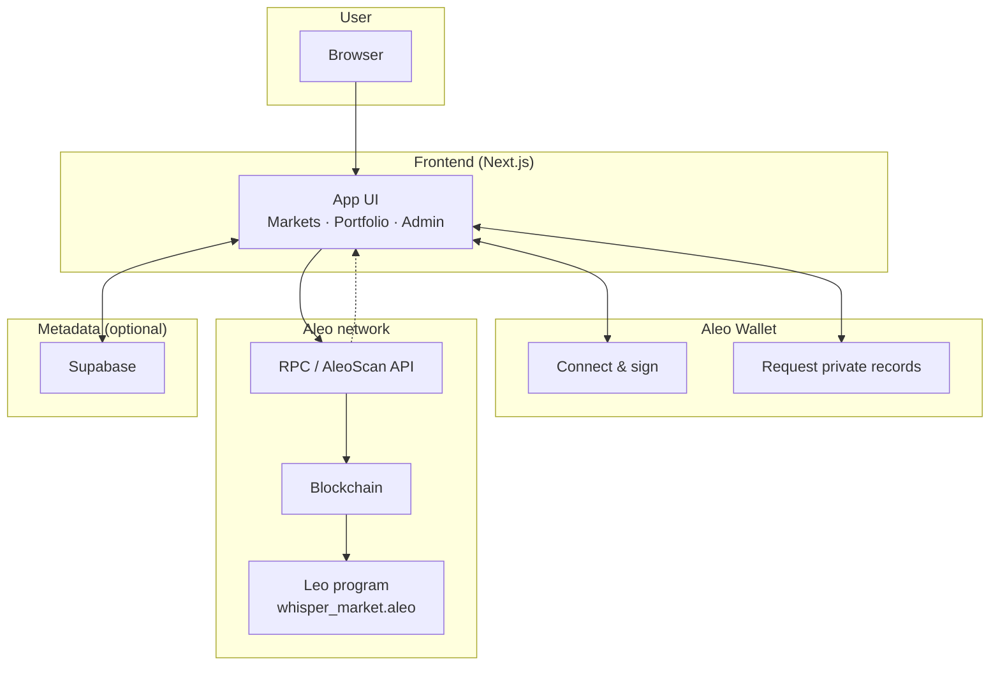

# Whisper Market

A decentralized prediction market application built on the Aleo blockchain. Users can create markets, buy positions, and redeem winnings based on market outcomes.

## Features

- Create prediction markets with custom questions and parameters
- Buy YES or NO positions using automated market maker (AMM) pricing
- Deposit and withdraw collateral; view position and share balances per market
- View market statistics including current prices, pool size, and fees
- Redeem positions after market resolution
- Portfolio view to track your positions across all markets
- Admin page for authorized resolvers to resolve and pause markets
- In-app transaction tracker for pending and recent transactions
- Automatic market discovery from on-chain data

## Tech Stack

- Frontend: Next.js 15, React 19, TypeScript, Tailwind CSS, DaisyUI
- Blockchain: Aleo (Leo program: `whisper_market.aleo`)
- Wallet: Aleo Wallet Adapter (supports Leo, Puzzle, Fox, Soter, Shield wallets)
- State management: React Query
- Optional: Supabase for market metadata (questions, descriptions)

## Prerequisites

- Node.js 18+ and Yarn
- Aleo CLI (Leo) installed and configured
- An Aleo wallet (Leo Wallet or compatible)

## Installation

1. Clone the repository
2. Install dependencies:
   ```bash
   yarn install
   ```

3. Configure environment variables:
   - Create a `.env` file in the project root (or copy from `.env.example` if present)
   - Set at least: `PROGRAM_NAME` (e.g. `whisper_market.aleo`), `RPC_URL`, and `ADDRESS` for the Leo program
   - Optionally set `NEXT_PUBLIC_SUPABASE_URL` and `NEXT_PUBLIC_SUPABASE_ANON_KEY` if using Supabase for market metadata

4. Build the Leo program:
   ```bash
   yarn program
   ```

## Development

Start the development server:
```bash
yarn dev
```

The application will be available at `http://localhost:3000`

## Available Scripts

- `yarn dev` - Start development server
- `yarn build` - Build for production
- `yarn start` - Start production server
- `yarn program` - Build and copy Leo program
- `yarn lint` - Run ESLint
- `yarn ts` - Type check without emitting files

## Project Structure

```
├── program/          # Leo smart contract (whisper_market.aleo)
│   └── src/
│       └── main.leo
├── src/
│   ├── assets/       # Global styles
│   ├── components/   # React components
│   │   ├── admin/    # Admin/resolver UI
│   │   ├── market/   # Market, buy form, stats, redeem
│   │   ├── portfolio/# Portfolio summary and position cards
│   │   ├── transactions/ # Transaction tracker
│   │   └── ui/       # Buttons, footer, loader
│   ├── config/       # Routes, admin addresses
│   ├── contexts/     # Transaction context
│   ├── lib/          # Core logic and integrations
│   │   ├── aleo/     # RPC, wallet, records, market registry
│   │   └── supabase.ts
│   ├── pages/        # Next.js pages (index, markets, market, portfolio, admin)
│   │   └── api/      # RPC and AleoScan proxy endpoints
│   ├── services/     # Market metadata (e.g. Supabase)
│   ├── layouts/      # App and dashboard layouts
│   ├── hooks/        # Custom React hooks
│   ├── utils/        # Fee calculator, position helpers, credits
│   └── types/        # TypeScript type definitions
└── public/           # Static assets
```

## Usage

1. Connect your Aleo wallet
2. Browse available markets on the markets page
3. Click a market to view details, deposit collateral, and buy YES or NO shares
4. Create new markets via "Create Market" (bond + initial liquidity required)
5. View your portfolio to see positions across markets
6. After a market is resolved, redeem winning positions (market page or portfolio)
7. Authorized resolvers can resolve and pause markets from the admin page

## Smart Contract

The Leo program (`whisper_market.aleo`) implements a prediction market with:
- Market initialization (bond, liquidity, fee in basis points, metadata hash)
- Private collateral deposits and position records
- AMM-based pricing for YES/NO shares (swap_collateral_for_yes_private / swap_collateral_for_no_private)
- Merge of YES/NO back to collateral; withdraw private
- Market resolution (YES/NO) and private redemption of winnings
- Fee collection; admin pause/unpause

## Technical Documentation

### High-level flow

The following diagram shows how the user, frontend, wallet, Aleo program, blockchain, and Supabase fit together:



- **User → Frontend:** Opens the app in the browser; sees markets, portfolio, create market, redeem, admin.
- **Frontend ↔ Wallet:** User connects wallet; app requests private credit records and builds transactions; wallet signs and submits (with private fees).
- **Frontend → RPC / Blockchain:** App reads public state (market IDs, resolution, pool stats) via RPC or AleoScan; transactions are submitted through the wallet and executed on-chain.
- **Blockchain → Leo program:** Transactions run the program (init, deposit, swap, redeem, resolve, etc.); private inputs/outputs stay encrypted.
- **Frontend ↔ Supabase:** Optional: app reads or writes market metadata (question text, descriptions) from Supabase; on-chain state remains the source of truth for existence and resolution.

### GitHub Repository

The full source code and this README are available in the project repository. Clone or fork the repo to run the app locally, build the Leo program, and contribute.

### Architecture Overview

- **Frontend (Next.js)** — Connects to the user’s Aleo wallet, fetches market data from chain/indexer, and builds transaction payloads for the Leo program.
- **Wallet adapter** — Handles record selection, signing, and submission of transactions with **private fees** (fees paid from private credits, not public balance).
- **Leo program** — On-chain logic for markets: init, deposit, AMM swaps (YES/NO), redeem, resolve, and admin (pause/unpause). All Aleo credit movements use **private transfers** (inputs and outputs are encrypted records).
- **Chain / RPC** — Execution and persistence of transactions; public state (e.g. market IDs, resolution) is readable; user positions and balances stay private.

### Privacy Model

When users **create markets**, **deposit** collateral, **buy or sell** shares, and **redeem** winnings, their activity is encrypted end-to-end:

1. **Private fees** — Every transaction (init, deposit, swap, redeem, resolve, etc.) is configured to pay fees from **private** Aleo credits. Fee payments are not visible on the public ledger.
2. **Private transfers** — The program uses private Aleo token transfers only. Collateral, shares, and payouts are represented as private records (inputs and outputs of the program); only the user and the program logic see amounts and ownership.

As a result, market creation, deposits, share trades, and redemptions are all privacy-preserving: balances, positions, and fee payments stay encrypted, while only the necessary public state (e.g. market existence, resolution outcome) is exposed.

## License

MIT
