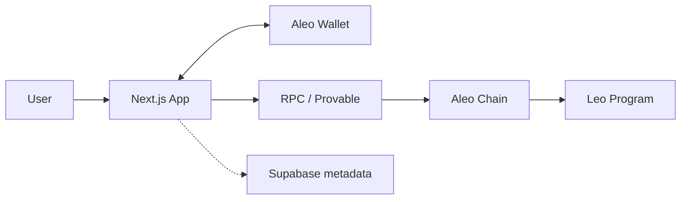

# Whisper Market

**Submission for [AKINDO Wave Hacks](https://app.akindo.io/wave-hacks/gXdXJvJXxTJKBELvo?tab=overview)** — a private prediction market on the Aleo blockchain.

---

## 1. Project Overview

### Name & description

**Whisper Market** is a privacy-preserving prediction market where users create markets, take YES/NO positions, and redeem winnings. All collateral, share balances, and fee payments are private; only market existence and resolution outcome are public.

### Problem being solved

Prediction markets need liquidity and participation, but public ledgers expose who bet what and when. That creates targeting, front-running, and reluctance to participate. Whisper Market uses Aleo’s private execution so that positions, sizes, and activity stay confidential while the market’s outcome and liquidity are verifiable on-chain.

### Why privacy matters for this use case

- **Position privacy** — No one can see how much you’ve staked or on which side, reducing targeting and copy-trading.
- **Fee privacy** — Transaction fees are paid from private credits so fee patterns don’t reveal activity.
- **Redeem privacy** — Claiming winnings doesn’t expose past positions or PnL on a public ledger.

Privacy encourages participation and larger size without sacrificing on-chain settlement and resolution.

---

## 2. Working Demo

- **Live app:** **[https://whispermarket.xyz/](https://whispermarket.xyz/)** (deployed on Vercel)
- **Network:** Aleo Testnet; connect with Shield wallet or any compatible Aleo wallet.
- **Leo program:** `whisper_market_v2.aleo` — deployed and callable from the app (init, deposit, swap, redeem, resolve, pause/unpause).
- **UI:** Next.js app with Markets list, per-market page (prices, buy/sell, position), Portfolio (positions + manage Cash), Create Market, and Admin (resolve/pause) for authorized resolvers.

Try it at [whispermarket.xyz](https://whispermarket.xyz/) 

---

## 3. Technical Documentation

### GitHub repository

This README and the full source code are in the project repository. The app is deployed on Vercel; the repo is for code reference and for anyone who wants to run or fork it.

### Architecture overview

- **Frontend (Next.js)** — Wallet connection (Aleo Wallet Adapter), reads market and mapping data via RPC/Provable API, builds and submits transactions (private fees, private transfers).
- **Wallet** — Signing and record selection; fees are paid from private credits.
- **Leo program** — On-chain logic: market init, global deposit/withdraw, open position, AMM buy/sell (YES/NO), merge, redeem, resolve, admin pause/unpause. All value movements use private Aleo transfers.
- **Chain / RPC** — Public state (market IDs, status, resolution, pool/reserves) is readable; user positions and balances remain private.

```mermaid
flowchart LR
  User[User] --> App[Next.js App]
  App <--> Wallet[Aleo Wallet]
  App --> RPC[RPC / Provable]
  RPC --> Chain[Aleo Chain]
  Chain --> Program[Leo Program]
  App -.-> Meta[Supabase metadata]
```

### Privacy model

- **Private fees** — Transactions pay fees from **private** credits; fee payments are not visible on the public ledger.
- **Private transfers** — Collateral, shares, and payouts are private records (encrypted inputs/outputs); only the holder and the program see amounts and ownership.
- **Public state** — Only what’s needed for the market to function is public: market existence, status (open/resolved/paused), resolution outcome, and aggregate pool/reserves for pricing. No per-user balances or history are exposed.

---

## 4. Progress Changelog (Wave 2+)

### What we built since last submission

- **UX:** Global “Cash” (collateral) moved to Portfolio; swap-style deposit/withdraw on Portfolio; header shows Cash balance; “Open position” block on market page when user has no position; Buy/Sell tabs; terminology aligned to “Cash” and “Available Cash” / “Total Shares.”
- **Markets list:** Faster load via parallel market ID and state fetches; list appears first with loading placeholders, then state fills in; simpler preview cards (price bar + pool/fee in one line).
- **Admin:** Resolve-market transaction uses a **public** fee so execution errors are visible; admin restricted to a single allowed wallet address.
- **Correctness:** Portfolio and market cards show “Total Shares” as YES + NO; “Committed” as YES + NO shares; “Total Cash” / “Available Cash” clarified so numbers add up.

### Feedback incorporated

- Simplified market list cards and reduced clutter on the main markets page.
- Clear separation of Cash (Portfolio) vs per-market position so deposit/withdraw lives in one place.

### Next wave goals

- **USDCx integration** — Support USDCx (or compatible stablecoin) so users can trade and settle in a familiar unit while keeping positions and activity private on Aleo.
- **UX improvements** — Refine flows (onboarding, deposit/withdraw, buy/sell), feedback and loading states, and mobile experience so the app feels fast and clear for both new and returning users.

---

## Submission

- **Buildathon:** [AKINDO Wave Hacks](https://app.akindo.io/wave-hacks/gXdXJvJXxTJKBELvo?tab=overview)
- **Live demo:** [https://whispermarket.xyz/](https://whispermarket.xyz/)

## License

MIT
